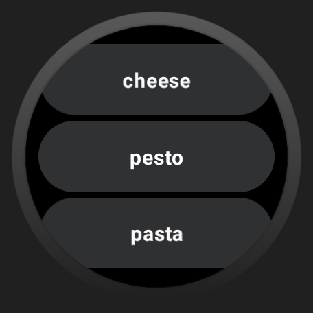

# Wear ToDo

Wear ToDo is an application designed for Wear OS devices, allowing you to interact seamlessly with your Microsoft To-Do tasks on your smart wearable. Please note that the app is currently *not* production-ready and has not been published on the Google Play Store.   
Its functionality is still in development, and it may not be generalized enough to suit all user needs.  
This repository is shared here to serve as a reference and starting point for fellow developers. It incorporates logic for authenticating with Microsoft To-Do using OAuth, as well as for reading and completing tasks.



Authentication
--------------

Authenticating with Microsoft To-Do can be a somewhat complex process. To set up the authentication, you must provide your OAuth information within the `app/src/main/assets/secrets.json` file. You can start by copying the template from `app/src/main/assets/secretsTemplate.json`.

```json
{
  "clientId": "",
  "clientSecret": "",
  "refreshToken": "",
  "listId": ""
}

```

Here are the key steps to set up authentication:

1. Create an app in the Azure Active Directory and obtain a client secret.
This process will provide you with the client_id and client_secret needed for authentication. You can find detailed instructions on how to do this in [Microsoft's official documentation](<https://docs.microsoft.com/en-us/azure/active-directory/develop/howto-create-service-principal-portal>).

2. You also need to retrieve the refresh token to be able to obtain a new token for every API call. The process for obtaining the refresh token is explained in [Microsoft's documentation](https://docs.microsoft.com/en-us/advertising/guides/authentication-oauth-get-tokens).


## Local development

This repository is designed to be used with Android Studio, and you can choose to run it on either an emulator or a physical Wear OS device.

### Emulator

I used the emulator "Wear OS Small Round API 30", others are not tested yet

### Device

To run the code on a physical device, you must first enable developer mode on your Wear OS device. This typically involves tapping the build number in the device settings approximately seven times. After enabling developer mode, you can pair your device with Android Studio via Wi-Fi or Bluetooth. Once paired, you can run the app from the device menu in Android Studio. More details can be found in the official Android Wearables documentation: [Debugging Wear OS](https://developer.android.com/training/wearables/get-started/debugging).

## Installation on device

To install the APK, you can build it using Android Studio and then install it on your Wear OS device using ADB (Android Debug Bridge).
Here are the necessary ADB commands:

Check connected devices:  
``` shell
adb devices
```

Connect:  
``` shell
adb connect <IP> # IP as shown in the developer mode of the watch.
```

Disconnect:  
``` shell
adb disconnect <name>
```

Install:  
``` shell
adb install wear-os.apk
```

## ToDo
* Add error handling
* Improve visuals
* Add checkbox look to chips
* Move configuration from code to app
* Publish app to PlayStore

Disclaimer
----------

Please be aware that this application has been tested on an emulator and on my personal device.
I cannot guarantee that it will function optimally and look great on all Wear OS devices. 

Additionally I'm actually a python backend developer and consequently my Kotlin skills and
*making things look nice* experience is very limited.

